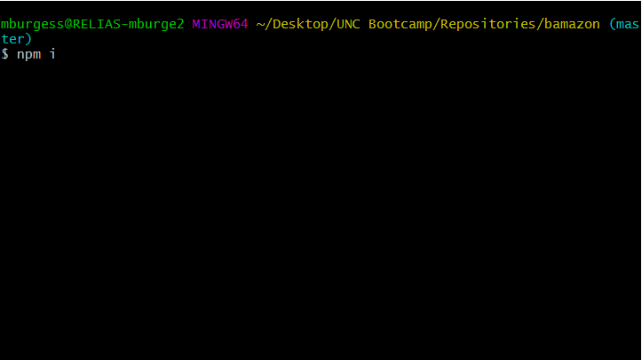
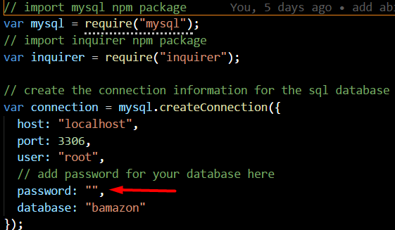
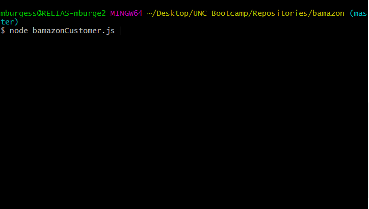
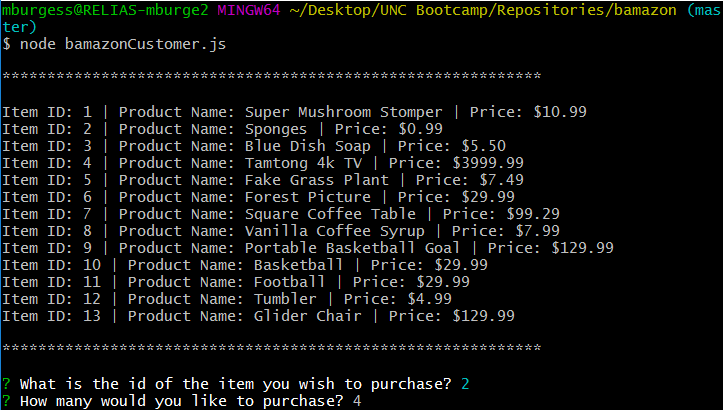
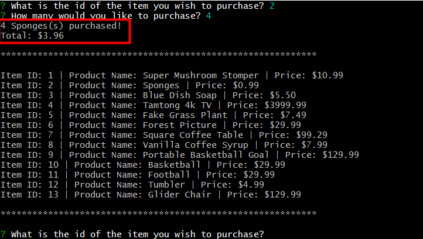
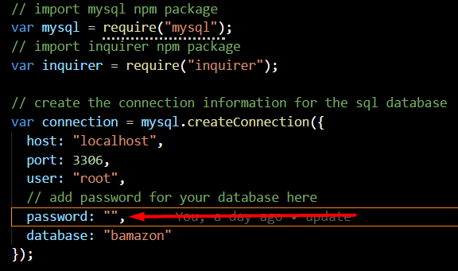
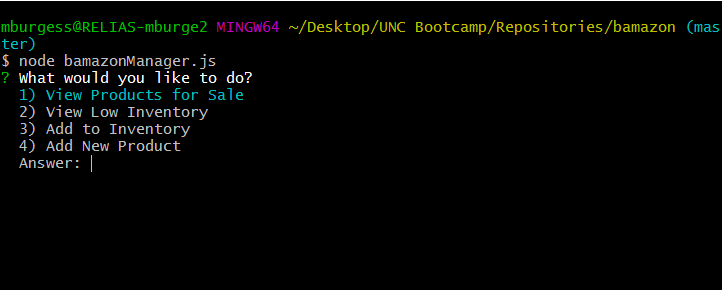
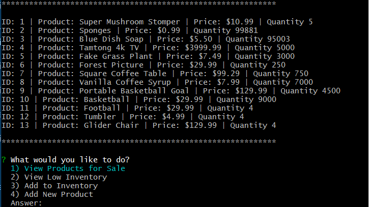
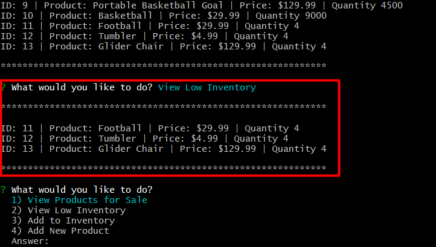
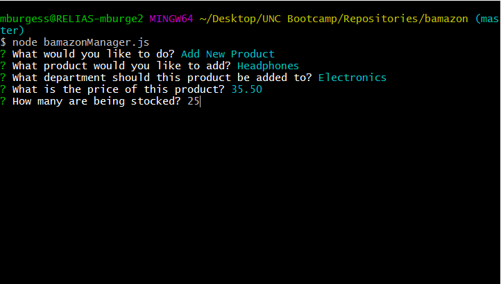

# bamazon
An Amazon-like storefront using Node.js &amp; MySQ

## Setup

First, clone the repository:

  <pre>git clone git@github.com:mickburgess/bamazon.git</pre>

Next install the dependencies

Create your database using the script in bamazonSchema.sql, and seed the created products table with data using the script in bamazonSeed.sql

## Customer Workflow

Add your database password

Run bamazonCustomer.js from the root folder. You are presented with a list of products with their associated id and price. You are prompted to enter the id of the item you would like to purchase.

You are then told the amount of items that were purchased and the total cost of the exchange.

## Manager Workflow

Add your database password

Run bamazonManager.js from the root folder. You are presented with a list of commands from which to choose.

Selecting 1 will give you a list of all the items that are for sale.

Selecting 2 will give you a list of all items that have a quantity less than 5

Selecting 3 will allow you to add quantity to a chosen item. The full list of items will be displayed and you will be prompted to insert the id of the one you want to add to, and then you will be prompted to enter the number you wish to add.

Selecting 4 will allow you to add a new product. First you will need to enter the name of the product, then you will be asked to enter the department for the product, followed by the price, and finally how many you want to restock.

